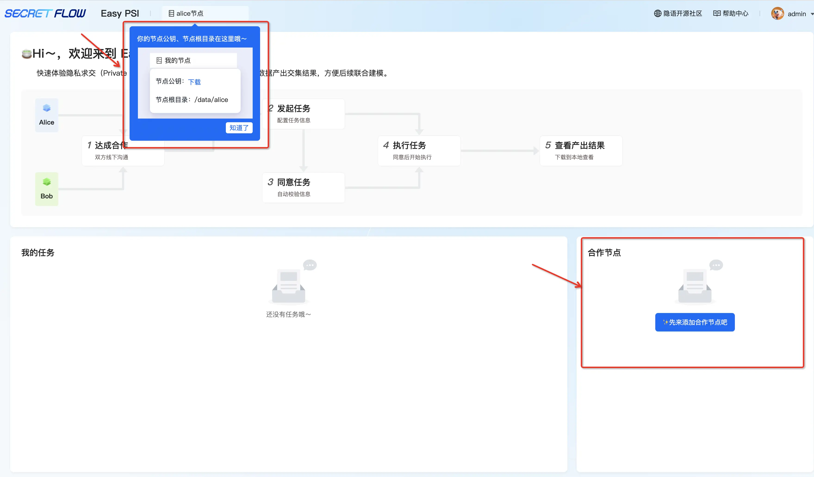

# 非新手创建 PSI 任务

### 一、创建 PSI 任务全流程

### 二、详细步骤说明
#### 第 1 步：线下交换节点公钥证书和通讯地址——双方添加合作节点

  
#### 第 2 步：进入我的任务列表界面——点击发起任务——填写任务名、选择数据表、关联键——选择可用节点作为合作节点、填写数据表、关联键——填写结果名、选择接收方——点击发起任务

   
 
#### 第 3 步：Bob 进入我的任务界面——列表/详情页面点击同意按钮，任务进入运行中状态——等待任务执行完成

 
#### 第 4 步：在详情页下载任务结果
#### 
