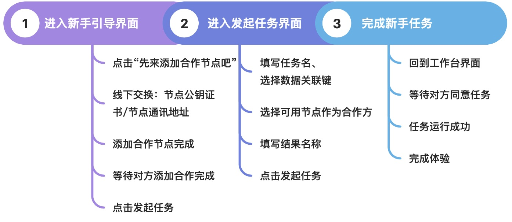
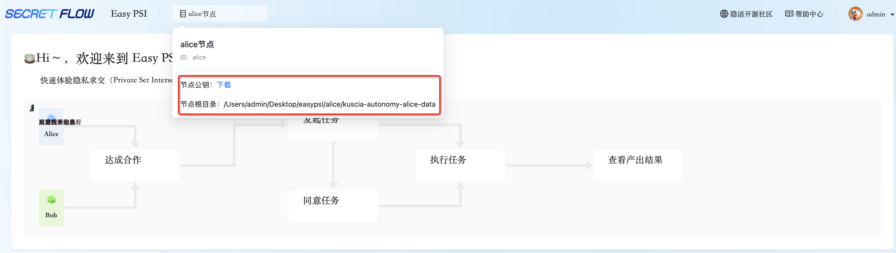
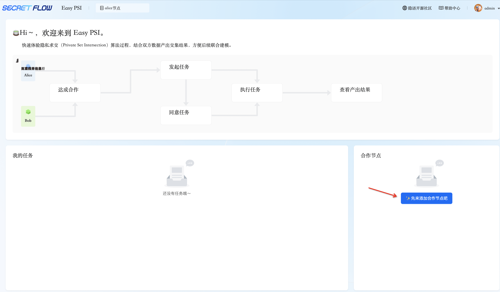
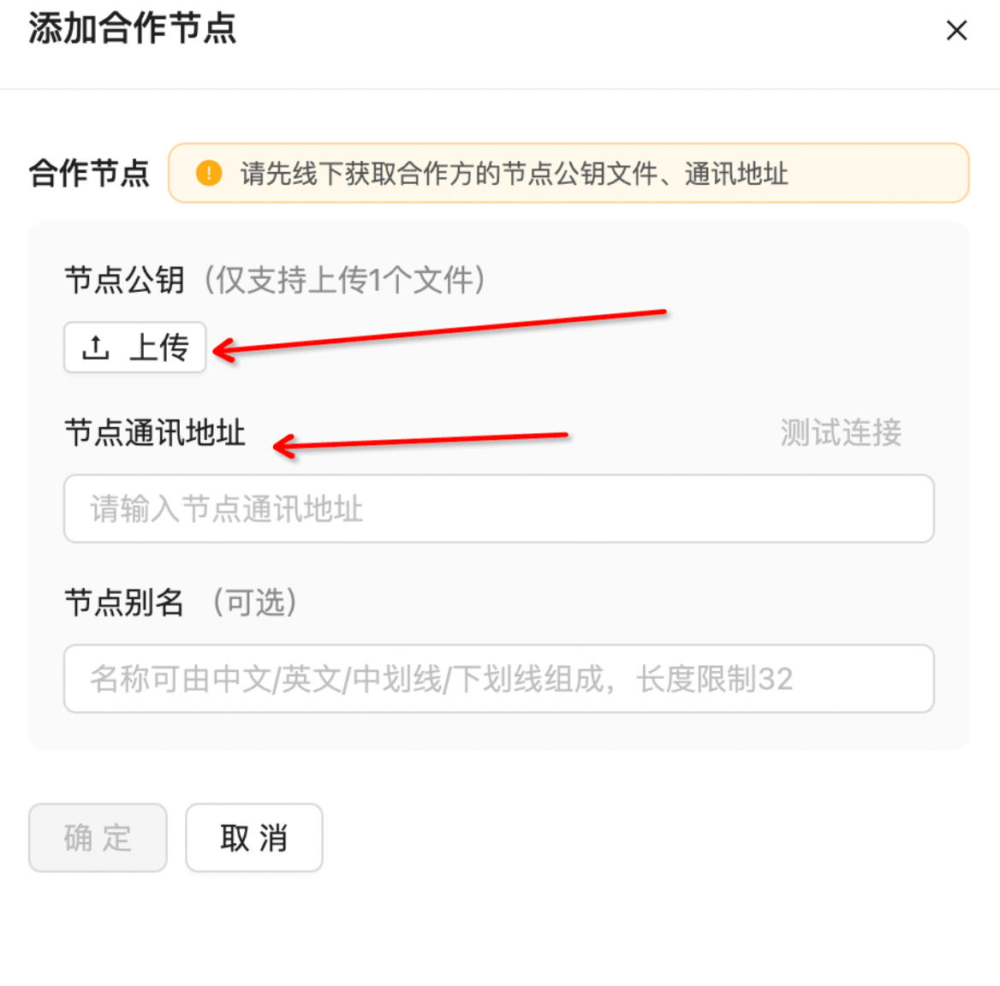
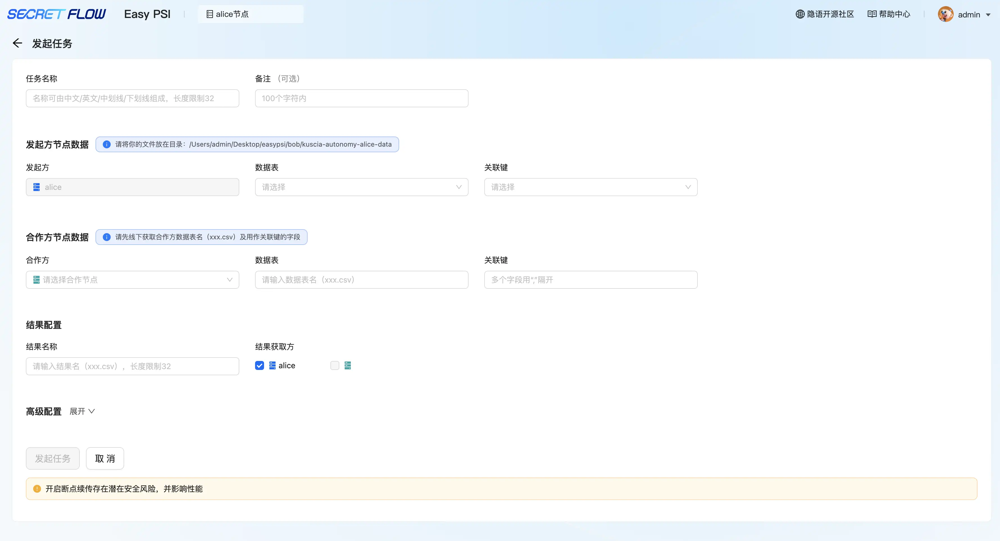
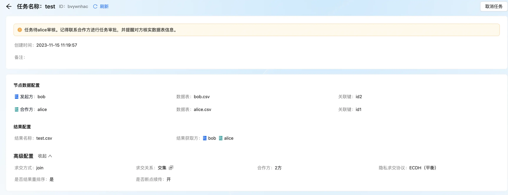
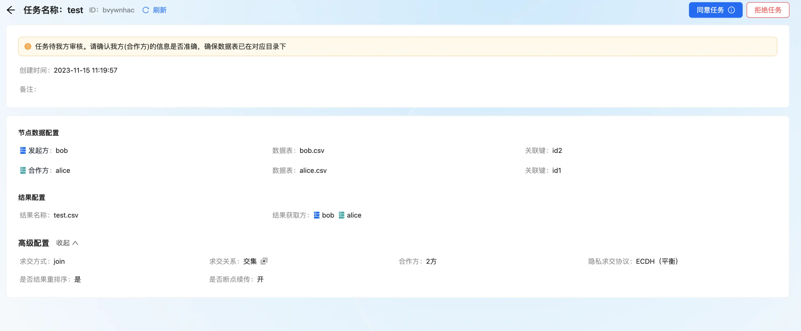
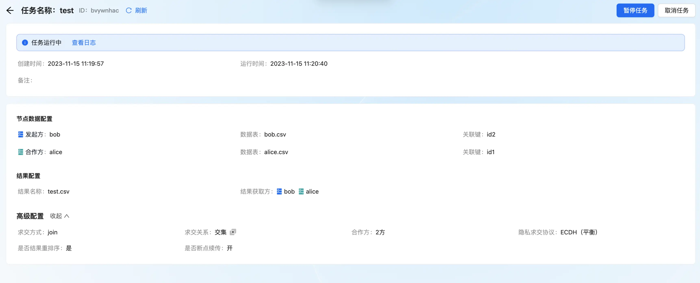
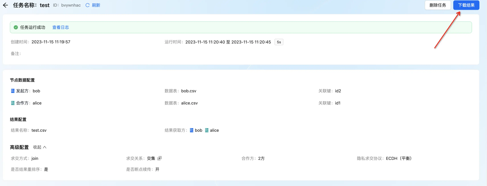

# Easy PSI 新手引导

### 一、新手引导全流程

### 二、详细步骤说明
#### 第 1 步：Alice 进入新手引导界面——点击先来添加合作节点吧——点击确定，完成合作节点添加——等待 Bob 添加合作节点
1）Alice节点公钥下载后线下和对方交换节点公钥和通讯地址   2）点击添加合作节点，可以添加合作方节点  3）添加合作节点详情 
#### 第 2 步： Bob 进入新手引导界面——点击先来添加合作节点吧——点击确定，完成合作节点添加

#### 第 3 步：Bob 点击发起任务——填写任务名、选择数据表、关联键——选择 Alice 作为合作节点、填写数据表、关联键——填写结果名、选择 Alice、Bob 双方作为接收方——点击发起任务

  
#### 第 4 步：Alice 进入任务详情页——点击同意按钮，任务进入运行中状态——等待任务执行完成

 
#### 第 5 步：在详情页下载任务结果
