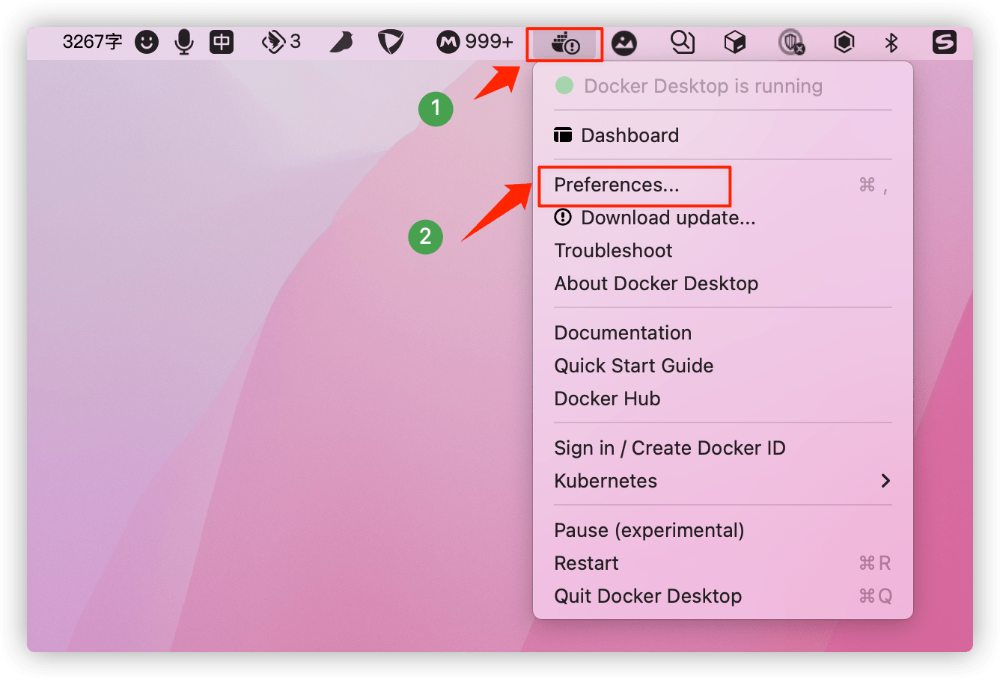
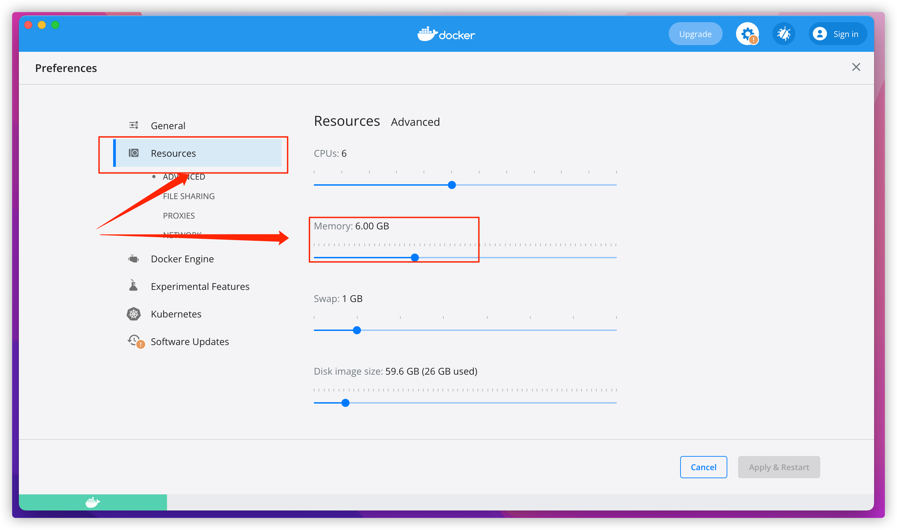
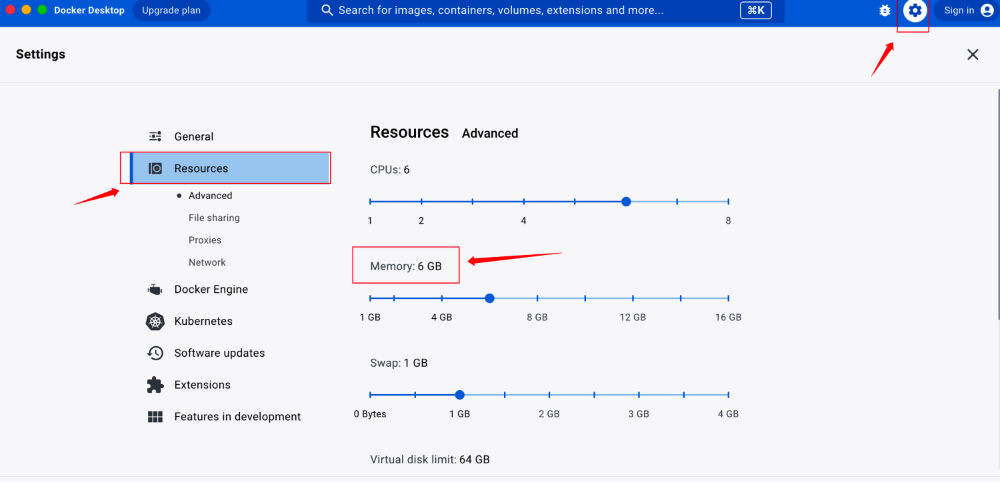
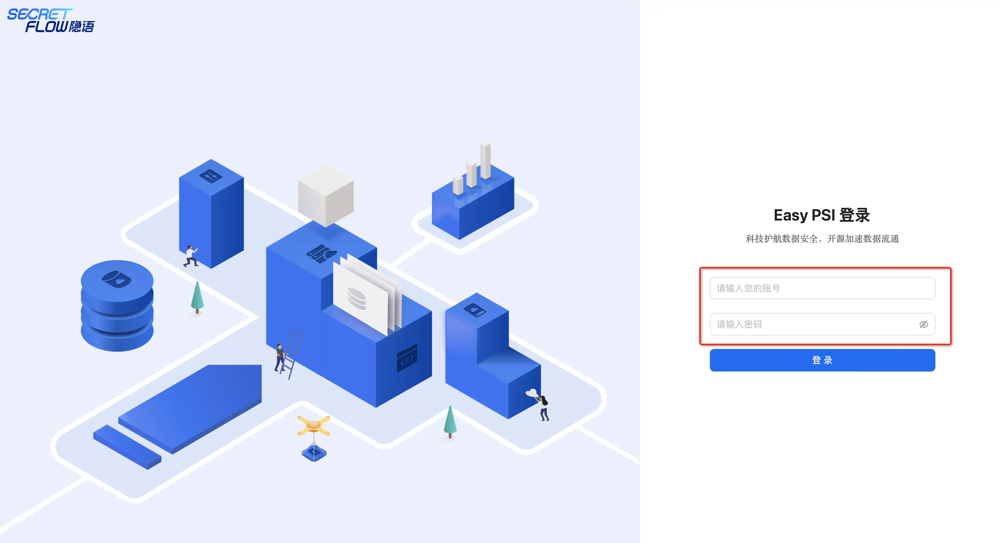
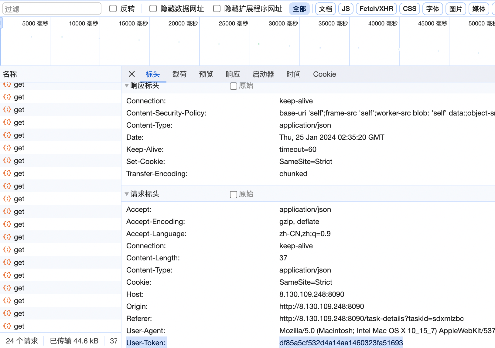

# Easy PSI 安装指引

欢迎使用隐语 Easy PSI。<br />不想安装？请参阅 [https://www.yuque.com/secret-flow/admin/wl2hba8vbkgpea4i]([https://www.secretflow.org.cn/zh-CN/docs/easy-psi/latest/wl2hba8vbkgpea4i](https://www.yuque.com/secret-flow/admin/wl2hba8vbkgpea4i))
# 安装包下载
 <br />[点击跳转到下载页面](https://www.secretflow.org.cn/deployment)
# 一、安装指南
## 1.1 系统要求
操作系统：MacOS（暂不支持 Apple Silicon）, CentOS7, CentOS8<br />推荐系统资源：8 core / 16G memory / 200G hard disk
## 1.2 Docker安装与配置
Tips：若已安装 Docker 可跳过此步骤。
### Linux

```
# 安装 docker。
yum install -y yum-utils
yum-config-manager \
	--add-repo \
	https://download.docker.com/linux/centos/docker-ce.repo
yum install -y docker-ce docker-ce-cli containerd.io

# 启动 docker。
systemctl start docker
```
### Windows系统
参考[Docker官方文档](https://docs.docker.com/desktop/install/windows-install/) 在Windows上安装 Docker，并确保 Docker 的后端是**WSL2**<br />MacOS 需将 docker container 内存上限提高为 6G。
<br />参考[WSL官方文档](https://learn.microsoft.com/en-us/windows/wsl/wsl-config#configure-global-options-with-wslconfig) 设置对应的设置即可
### Mac OS
参考官网进行安装<br/> [https://docs.docker.com/desktop/install/mac-install/](https://docs.docker.com/desktop/install/mac-install/)
#### <font color ="red">非常重要📢 ： Docker 配置 </font>
**MacOS 需将 Docker container 内存上限提高为6G。操作步骤如下（版本不同操作入口可能不同）：**<br />
示例一：<br/>



<br />
示例二：<br /> 
## 1.3 Easy PSI 部署包安装（Mac）
#### 第 1 步：解压部署包
下载部署包后解压部署包。
#### 第 2 步：安装部署

1. 通过 cd 指令进入解压缩之后的部署包目录（也可以把解压的安装包拖入到终端）。

```
# 定位到解压后的文件夹
cd secretflow-easy-psi-allinone-package-0.1.5beta/
```
Tips：如果是更新版本，需要先运行 uninstall.sh 卸载。

```
sh uninstall.sh all
```

1. 执行 install.sh 安装 Easy PSI
   1. 一般来说，可以执行以下指令

```
# e.g. sh install.sh -n alice
sh install.sh -n <节点id>
```
Tips：若同一台电脑安装两个节点，需要保证两个节点 ID /路径/端口均应不同。

   1. 如果你遇到如下错误，则意味着默认端口被占用

```
docker: Error response from daemon: Ports are not available: listen tcp 0.0.0.0:8081: bind: address already in use.
```
你需要执行完整的安装指令以避免端口冲突：

```
# e.g. sh install.sh -n alice -d $HOME/p2p_alice -s 10800 -k 10801 -p 10802 -g 10803
sh install.sh -n <节点id> -d <安装路径> -s <平台端口> -k <kuscia http api port> -p <kuscia gateway port> -g <kuscia grpc api port>
```
TIPs：

- 若同一台电脑安装两个节点，需要保证两个节点ID/路径/端口均应不同。
- 节点id须为小写字母或者小写字母+数字组合。
- kuscia gateway port将会被用以节点连接，您需要将其告知合作方。
- 平台端口为web界面端口，请使用这个端口访问Easy PSI界面。

安装过程需要一些时间，请耐心等待。
#### 第 3 步：设置登录 Web 页面的用户名和密码
**用户名:** 长度要求大于 4 位字符<br /> 
**密码:** 大于 8 位字符。必须包含大小写及特殊字符。

```
Please set the username and the password used to login the KUSCIA-WEB.
The username requires a length greater than 4, The password requires a length greater than 8,
including uppercase and lowercase letters, numbers, and special characters.
Enter username(admin): <your usename, enter directly to use default value>
The username requires a length greater than 4

would use default user: admin
Enter password: <your password>
Confirm password again: <your password>
The user and password have been set up successfully.
```
#### 第 4 步：安装完成
看到 “web server started successfully” 则代表部署成功

```
web server started successfully
Please visit the website http://localhost:10800 (or http://{the IPAddress of this machine}:10800) to experience the Kuscia web's functions .
The login name:'admin' ,The login password:'***' .
The demo data would be stored in the path: /Users/junfeng/kuscia/p2p/kuscia-autonomy-alice-data .
```
目前不支持更改用户名/密码，不支持找回用户名/密码，请妥善保相关信息。
#### 第 5 步：浏览器访问平台
请在浏览器打开成功安装信息中的域名，请使用部署过程中配置的用户密码登陆平台。<br />恭喜你完成 Easy PSI 的安装，现在开始体验吧。
## 1.4 Easy PSI 日志hash上链功能（可选）
### 1.4.1 业务场景
上链内容分为如下两类，为日志文件的sha256的hashs

| 日志内容 | **说明**                                     | 日志目录             |
|------|--------------------------------------------|------------------|
| 用户操作 | 用户平台操作，如：登录登入，创建任务，添加合作节点 。平台日志会在用户退出时滚动上链 | /app/log/easypsi |
| 引擎日志 | 隐私求交日志记录。（隐私任务完成时会操作上链）                    | /app/log/pods    |

### 1.4.2 Hyperledger Fabric
Easy PSI 目前仅支持 Hyperledger Fabric。<br />参考官网说明：<br />[https://hyperledger-fabric.readthedocs.io/en/latest/index.html](https://hyperledger-fabric.readthedocs.io/en/latest/index.html)
### 1.4.3搭建HLF区块链
你可以使用HLF test network来进行测试。

- [https://hyperledger-fabric.readthedocs.io/en/latest/test_network.html](https://hyperledger-fabric.readthedocs.io/en/latest/test_network.html)

搭建一个生产级别的HLF区块链网络，可参考方案：AWS/阿里云/官网教程。

- [https://docs.aws.amazon.com/managed-blockchain/latest/hyperledger-fabric-dev/what-is-managed-blockchain.html](https://docs.aws.amazon.com/managed-blockchain/latest/hyperledger-fabric-dev/what-is-managed-blockchain.html)
- [https://help.aliyun.com/document_detail/89193.html](https://help.aliyun.com/document_detail/89193.html)
- [https://hyperledger-fabric.readthedocs.io/en/latest/deployment_guide_overview.html](https://hyperledger-fabric.readthedocs.io/en/latest/deployment_guide_overview.html)
### 1.4.4 Easy PSI开启日志hash上链功能
#### 1.4.4.1 找到运行容器

```
#查看容器运行进程
docker ps
#找到名称为root-kuscia-easypsi-* 的容器
#其中CONTAINER ID为容器id
#进入容器
docker exec -it ${容器id} bash
```
#### 1.4.4.2 配置证书
#### 配置证书
证书为创建链时创建的证书 证书文件<br />其中需要的证书文件为：keystore.pem、signCert.pem、tls.pem<br />其中keystore.pem是Easy PSI节点 TLS公钥<br />signCert.pem是Easy PSI节点 TLS私钥<br />tls.pem是HLF peer node TLS公钥

```
#tmp/fabric为原始证书目录   /app/config为目标目录
应得到目录为/app/config/fabric
docker cp /tmp/fabric ${容器id}:/app/config
最终结果为：/app/config/fabric文件夹下包含上述三个证书文件
```
#### 1.4.4.3 配置Easy PSI
修改配置文件

```
cd /app/config/
#根据启动环境 修改application-环境.yaml文件
#使用vi编辑文件  

fabric:
  is-open: true # 默认为false
  address: 127.0.0.1:7051 #链地址
  msp-id: //和链保持一致
  channel-name:  //和链保持一致
  chain-code-name: //和链保持一致
  override-auth: //和链保持一致
  owner: easypsi //可自定义
  sign-cert-path: config/fabric/signCert.pem
  keystore-path: config/fabric/keystore.pem
  tls-cert-path: config/fabric/tls.pem
```
#### 1.4.4.4 平台日志查询
容器中查看日志

```
cd /app/log/easypsi
#其中当前日志命名为：easypsi.log
#截断日志命名为：easypsi-yyyy-MM-dd-HH-mm-ss.log
```
#### 1.4.4.5 引擎日志查询
服务器中查看日志

```
cd /app/log/pods
# 查看所有日志文件 
ls 
文件名组成为：nodeId + "_" + job.getId() + "-0" 开头
#查看日志内容
cat 文件名.log 
ps: job id可在平台任务详情页中查看
```
#### 1.4.4.6 日志hash上链结果查询
前置条件 获取token<br />在平台中 F12进入调试模式<br />从请求->请求头中获取User-Token<br />

```
http://{平台id}:{平台port}/api/v1alpha1/fabricLog/query
```
请求方式 POST<br />请求参数<br />请求头

| 参数名称          | 参数说明    | 类型     | 是否必填 |
|---------------|---------|--------|------|
| hearder参数     |         |        |      |
| User-Token    | 用户token | String |      |
| body参数 json格式 |         |        |      |
| logHash       | 文件hash  | String | 否    |
| logPath       | 文件路径    | String | 否    |

请求示例<br />{"logHash":"f8283a49c229db6f25b43276e0730bd465d379e9f9c8dcd647df5c3e3ac2ae1d"}<br />{"logPath":"/app/log/easypsi/easypsi-2024-01-15-18-22-06.log"}<br />此处需注意：logPath和logHash二选一，但是不支持模糊匹配<br />logPath需包含文件名<br />查询结果参照如下相应<br />返回参数实例

```
{
    "status": {
        "code": 0,
        "msg": "操作成功"
    },
    "data": "{\"owner\":\"easypsi\",\"path\":\"/app/log/easypsi/easypsi-2024-01-15-18-22-06.log\",\"assetID\":\"f8283a49c229db6f25b43276e0730bd465d379e9f9c8dcd647df5c3e3ac2ae1d\"}"
}
```

```
{
    "status": {
        "code": 202011105,
        "msg": "系统错误: data is null"
    },
    "data": null
}
```
